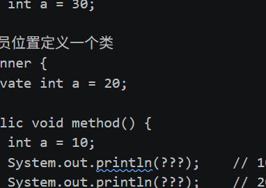

引用相等："=="
    "=="比较的是两个变量是否指向内存的同一个对象
    ```Java
        String a = new String("hello");
        String b = new String("hello");
        System.out.println(a == b);  // false — 堆里是两个不同的对象
    ```
    
对象相等：equals（）
    "equals()"比较的是两个对象在逻辑上是否相等
    ```Java
        String a = new String("hello");
        String b = new String("hello");
        System.out.println(a.equals(b));  // true — String 重写了 equals，比较字符序列
    ```
>特殊情况:字符串常量池
>Object类 如果没有重写equals()方法，将退化为"=="


String、StringBuilder、StringBuffer
String：不可变长 线程安全 拼接时产生大量临时对象 底层实现：final byte[] 
StringBuilder:可变长 线程不安全 快 继承AbstractStringBuilder，可扩容
StringBuffer：可变长 线程安全 相StringBuilder来说较慢 继承AbstractStringBuilder，可扩容

>StringBuilder、StringBuffer最常用的场景大多数与字符串拼接（需要.append()）相关
>算法竞赛中：经常在需要频繁的进行字符串拼接以及需要每一步都需要修改字符串（利用"可变长的"特性）
>删除字符串中相邻重复项

字符串拼接场景：
    ```Java
        String s1 = "hello";
        String s2 = "World";
        String s3 = s1 + s2 
        System.out.println(s1 + "," + "s2")
    ```

    ```Java
        String name = "张三"
        int age = 25;
        String info = "姓名：" + name + ",年龄：" + age;
        String info = new StringBuilder().append("姓名：").append(",年龄：").append(age).toString;
    ```

    常用用法：
    ```Java
        StringBuilder sb = new StringBuilder();
        for(int i = 1; i <= 10000;i++){
            sb.append(i);
        }
        String result = sb.toString;
    ```

遍历map集合的两种不同方式：
    方式一：通过map.keySet()获取map的所有键，并将其赋值给创建的Set集合对象，通过增强型for循环遍历Set集合。再在循环体中取出键所对应的值。
    ```java
        import java.util.*;
        public class maploop{
            public static void main(String args[]){
                Map<String,String> map= new HashMap<String,String>;
                map.put("一号"，"张三");
                map.put("二号"，"李四");

                //利用Set集合获取map集合的所有键
                Set<String> keys = map.keySet();

                //增强型for循环
                for(String key : keys){
                    String value = map.get(key);
                    System.out.println(key + ":" + value);
                }
            }
        }
    ```
    
    方式二：通过map.entrySet()获取map的所有键值对
    ```java
        import java.util.*;
        public class maploop{

            
            public static void main(String args[]){
                Map<String,String> map= new HashMap<String,String>;
                map.put("一号"，"张三");
                map.put("二号"，"李四");

                //利用Set集合获取map集合的所有键
                Set<Map.Entry<String,String>> entries = map.entrySet();

                //增强型for循环
                for(Map.Entry<String,String> entry : entries){
                    String key = entry.getKey();
                    String value = entry.getvalue();
                    System.out.println(key + ":" + value);
                }
            }
        }
    ```

Object类
>黑马程序员Java：day18-API

包装类：
>黑马程序员Java：day20-API

内部类：
    

    内部类面试题：
    请在?地方向上相应代码,以达到输出的内容
    注意：内部类访问外部类对象的格式是：**外部类名.this**
    ```java
    public class Test {
        public static void main(String[] args) {
            Outer.inner oi = new Outer().new inner();
            oi.method();
        }
    }

    class Outer {	// 外部类
        private int a = 30;

        // 在成员位置定义一个类
        class inner {
            private int a = 20;

            public void method() {
                int a = 10;
                System.out.println(???);	// 10   答案：a
                System.out.println(???);	// 20	答案：this.a
                System.out.println(???);	// 30	答案：Outer.this.a
            }
        }
    }
    ```


Java8新特性、函数式编程：Stream流、Lambda表达式、匿名内部类
>黑马程序员：day26-Stream流&方法引用
>动力节点：doucument14~16

# 集合
## List
### ArrayList源码解析：
    

# Java并发：
线程同步方法解决线程/数据安全问题：
    同步代码块解决数据安全问题：
        安全问题出现的条件：    
            多线程环境
            有共享数据胡
            多条语句操作共享数据
        结局和多线程安全问题的方式：
            让程序没有产生安全问题的环境
        如何实现：
            给多条语句操作共享数据的代码（可能有安全问题）上锁，使得任意时刻只有一个线程执行
            Java提供同步代码块的方式解决
        同步代码块格式，使用关键字synchronized：
        ``` Java
            synchronized(任意对象){
                多条语句操作共享数据的代码
            }
            //synchronized(任意对象)，就相当于给代码加锁，任意对象看作锁
        ```
        好处：解决多线程环境下的线程安全问题
        弊端：当线程很多时，每个线程都需要判断同步上的锁，性能开销大，会降低程序运行效率


    同步方法解决数据安全问题
        同步方法定义：将synchronized关键字加在方法上：
        语法格式：
        ``` Java
            修饰符 synchronized 返回值类型 方法名(方法参数){
                方法体；
            }
        ```

    Lock锁：
        同步代码块和同步方法的锁无法直接看到加在了哪里，在哪里释放
        JDK5之后添加了锁对象：Lock，可以解决以上问题

        ReetrantLock构造方法
        ReentrantLock(),创建一个ReentrantLock的实例

        加锁解锁方法：
            加锁方法：void lock()，获得锁
            解锁方法：void unlock(),释放锁

迭代器中的线程安全问题，迭代器遍历时增删会报错：
    增强 `for` 循环底层使用的是 `Iterator`。迭代器创建时，会记录集合当前的结构修改次数。
    `ArrayList` 内部大致维护：
    `int modCount;int expectedModeCount;` 
    add()、remove()改变集合结构后，modeCount发生变化及expectedModeCount未发生变化，迭代器下次检查发现二者不同，抛出ConcurrentModificationException
    单线程遍历安全删除：使用迭代器自己的remove()方法
    同步集合遍历需要手动加锁，如果多线程操作同一集合对象数据时存在线程安全问题

什么是临界区？
    answer:
    临界区：访问共享的可变资源，且这段访问不能被多个线程同时执行的代码区域
    共享：多个线程都能访问；可变：状态会被修改；互斥：同一时刻只有一个线程进入；
    举例：
    ```java
    class Account {
            //balance:共享可变状态
        private int balance = 100;
            //为保证线程安全，在方法前加synchronized关键字锁if(...){...}，if(...){...}就是共享区
        public void synchronized withdraw(int amount) {
            if (balance >= amount) {
                balance -= amount;
            }
        }
    //共享资源：balance
    //     ↑
    //临界区：读取、判断、扣减 balance 的代码
    //     ↑
    //锁：保证同一时刻只有一个线程进入临界区
    //}
    ```
    临界区不能太大也不能太小：
    太大：并发性能差
    太小：可能会破坏原子性